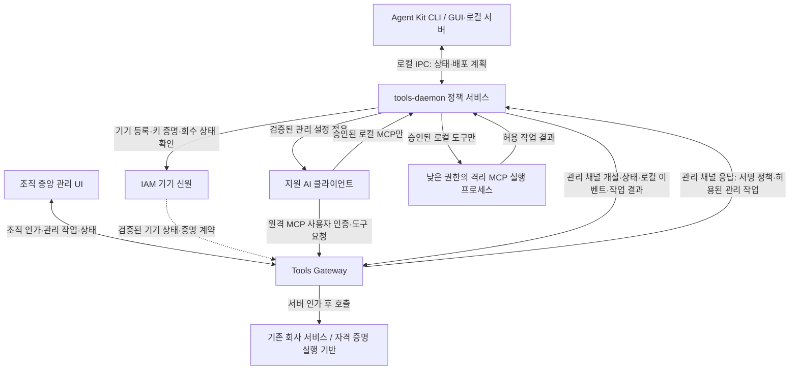

# Agent Kit · Tools Daemon · Tools Gateway 구현 계획

- 작성일: 2026-09-23
- 기기 신원 연동 보완: 2026-09-25. IAM이 등록·회수를 소유하고 서비스별 OAuth/OIDC scope·claim 및 요청 증명 계약으로 소비한다. [상세 계약](../architecture/iam-device-identity-contract.md).
- 역할·후속 순서 확정: 2026-09-24. Kit은 개인 로컬 관리, Gateway 연계 UI는 조직 중앙 관리, 데몬은 단말 집행을 담당한다.
- 상태: 구현 계획안. 클라이언트→Gateway 원격 호출과 데몬→Gateway 관리 통신의 통합 검증은 아직 전이다.
- 범위: 업무에 쓰는 회사 지급·개인 소유 PC에 Agent Kit 설치·조직 등록을 의무화한다.
- 우선순위: 이 문서가 [기능 평가](security-companion-plan.md)의 넓은 후보 목록보다 이번 구현 범위와 순서에 우선한다.

## 1. 첫 출시 목표와 범위

**목표: 지원하는 AI 클라이언트에서 승인된 MCP만 사용하고, 로컬 도구는 데몬의 제한된 실행 환경에서, 회사 서비스 도구는 Gateway의 인가 경계에서 실행한다.** 사용자는 자신의 설치·정책·차단 사유·로컬 이력을 Agent Kit에서 확인하고, 조직 운영자는 Gateway와 연계한 중앙 UI에서 관리 기기의 상태·정책·감사를 확인한다.

개발 대상은 세 구성 요소다. 방화벽, NAC, VPN, 보안 프록시, TLS 검사, 외부 MDM/EDR/DLP 제품 연동은 이번 구현의 필수 의존성에서 제외한다. OS 서비스·권한·키 저장소·프로세스 격리 API와 클라이언트 공식 관리 설정은 세 구성 요소 내부에서 활용한다. 데몬이 실행한 MCP의 통신을 OS 격리로 제한하는 것은 범위에 포함하며, PC 전체 트래픽을 검사하는 기능은 포함하지 않는다.

기존 IAM은 사용자·기기 신원과 등록·회수의 기준으로, Credential Broker는 Gateway 뒤의 외부 자격 증명 실행 기반으로 재사용한다. IAM의 기기 등록 기능은 현재 코드에서 확인되지 않아 신규 계약·구현이 필요하다. 기기 신원은 서비스별 OAuth/OIDC scope·claim 계약으로 제공하며 Gateway가 첫 소비자다. 다른 IAM 서비스에는 일괄 강제하지 않는다. 네 번째 사용자용 제품이나 별도 로그인 체계를 신설하지 않는다. 사용자/테넌트 소유 외부 서비스 자격 증명을 데몬이나 AI 클라이언트에 전달하지 않는 기존 경계를 유지한다.

### 이번에 구현할 보안 보장

| 대상 | 첫 출시 완료 조건 | 범위 밖 또는 별도 조건 |
|---|---|---|
| 관리 대상 클라이언트의 MCP | 승인된 로컬 연결만 구성하고 비인가 로컬·원격 MCP 사용 거부 | 다른 미관리 클라이언트와 사용자가 직접 실행하는 전체 프로그램 통제는 별도 OS 확장 |
| 로컬 MCP 실행 | 데몬이 승인된 버전만 제한된 권한으로 실행. 허용 범위 밖 파일 읽기·쓰기·통신 거부 | 데몬 밖 프로세스까지 같은 보호를 받는다고 표시하지 않음 |
| Gateway 도구 | 사용자·도구·자원 정책을 서버에서 검사. 기기 조건은 직접 호출을 해당 기기와 검증 가능하게 묶은 뒤 적용 | Gateway를 통하지 않는 Git·VPN·개별 API의 기기 통제는 이번 범위 밖 |
| 설정·정책 | 일반 사용자·MCP가 조직 정책과 보호된 실행 파일을 바꿀 수 없음 | 로컬 관리자/root 침해에 대한 변조 방지 보장 없음. 부여 권한별 시험 결과 표시 |
| 중지·회수 | 로컬 관리 실행 중지, 서버 신규 실행 차단, 상태 만료 후 갱신 거부 | 이미 완료된 외부 작업 취소·단말 자료 원격 삭제는 별도 기능 |
| 유출 방지 | 관리된 도구의 권한 축소와 Gateway의 기존 입력·출력 검사를 검증 | 전체 LLM 프롬프트, 개인 브라우저, USB, 모든 외부 전송의 DLP는 이번 범위 밖 |

지원 클라이언트 안의 내장 shell·확장·호스트 제공 연결도 우회 시험 대상이다. 필수 통제를 해당 클라이언트에서 강제할 수 없으면 기업 보안 모드 지원 완료로 표시하지 않는다. 탐지 기능만 제공할 수 있는 조합은 별도 상태로 표시한다.

첫 검증 대상은 사용자 요청에 따라 **macOS + Codex**로 정한다. 로컬 실측 이후의 착수 순서는 5장의 LM1~LM5를 따른다. 데몬의 관리 통신과 Codex의 Gateway 직접 원격 MCP 호출은 각각 연결해 두 경로의 역할을 확인한다. Codex CLI에서 반복 가능한 통합 시험을 구성하고, 현재 사용하는 Codex 데스크톱 앱에서 실사용 동작을 별도로 확인한다. Claude Code 구독은 필요하지 않으며 해당 클라이언트는 후속 호환 대상으로 둔다. OS 격리 방식·배포 가능성·각 실행 환경의 실제 지원 버전은 연결 개발과 병행 검증한다.

공통 MCP 정책·도구 인가·데몬 실행 경계는 클라이언트와 독립적으로 설계한다. Codex 관련 코드는 설정 배포·관리 요구사항·연결·호환 시험 어댑터에 둔다. 브라우저 ChatGPT는 로컬 Codex 설정을 읽지 않으므로 이후 별도의 Gateway 원격 연결 사례로 검증한다.

### Codex 첫 검증의 구체 범위

- 2026-09-23 로컬에서 `codex-cli 0.145.0`을 확인했다. 데스크톱 앱의 내장 런타임 버전과 동일하다고 가정하지 않는다.
- 원격 회사 도구는 Codex의 원격 MCP 연결에서 Gateway로 직접 요청한다. 로컬 관리 MCP가 필요한 경우에만 Codex의 stdio 연결을 데몬의 로컬 실행 경계에 연결한다. 데몬은 원격 MCP 프록시가 아니다.
- Codex 일반 MCP 설정은 `config.toml`, 강제 정책은 시스템 `requirements.toml`로 구분한다. macOS의 공식 시스템 요구사항 경로는 `/etc/codex/requirements.toml`이며 이번 문서 변경으로 실제 파일을 수정하지 않는다.
- 공식 문서의 `mcp_servers` 허용 목록은 이름과 identity를 검사한다. 실행 명령만 맞추는 문자열 규칙과 인수까지 검사하는 구조화 규칙의 지원을 설치 버전별로 시험한다. 작업 디렉터리·환경변수·실행물 변조는 허용 목록만으로 검증되지 않으므로 보호된 연결 어댑터와 데몬에서도 통제한다.
- 플러그인 제공 MCP, 앱 연결, 사용자/프로젝트 설정, CLI override, 내장 shell·권한 프로필 확대를 우회 시험에 포함한다. OS 파일로 배포하는 방식부터 검증하며 구독별 cloud-managed 기능을 필수 전제로 두지 않는다.

## 2. 세 구성 요소의 책임

| 구성 요소 | 직접 구현하는 기능 | 권한과 소유권 |
|---|---|---|
| Agent Kit CLI / GUI·로컬 서버 | 개인 PC의 승인 카탈로그, Manifest·클라이언트 설정·Skill/MCP 배포 계획·Diff·검증·롤백, 등록 안내, 데몬 상태·차단 사유·예외 요청 | 일반 사용자 프로세스. 로컬 GUI 서버와 CLI는 같은 application service 및 데몬 IPC 어댑터 사용. 조직 정책 변경 권한은 부여하지 않음 |
| `tools-daemon` | Kit의 로컬 IPC 및 중앙 관리 요청 검증, 서명 정책·보호 설정 적용, 로컬 MCP 인가·격리 실행·종료, 관리 자원 상태·감사 보고 | 두 관리 경로 모두 공통 인가·집행 경계를 통과. 보호된 정책 서비스와 낮은 권한의 도구 실행 프로세스 분리. 임의 shell 관리자 API 금지 |
| Tools Gateway + 연계 중앙 UI | 조직 정책·승인·회수, 기기별 관리 자원 현황, 제한된 단말 관리 작업 발행·결과 확인, 서버 도구 인가, 중앙 감사 | 조직 정책과 관리 작업의 권한 검사·이력 소유. IAM의 검증된 기기 상태 소비. 기기 등록부는 소유하지 않으며 원격 도구는 서버에서 매 실행 인가 |

데몬의 MCP 진입점과 실행 어댑터는 기업 모드의 선택 모듈이다. 별도 AI 모델·에이전트 루프·장기 기억 기능을 만들지 않는다. 일반 설정 배포는 데몬과 Gateway가 없어도 기존 방식으로 동작한다. 기업 모드의 정책 변경도 기존 배포 계획·소유권·충돌·트랜잭션·롤백 규칙을 통과해야 한다.

Kit의 JavaScript 서버는 개인 로컬 UI를 지원하는 서버다. 조직 중앙 관리 서버로 확장하지 않는다. Kit UI가 닫혀도 데몬은 독립 실행하며, 중앙 UI는 Gateway의 관리 API를 사용한다. 중앙 관리 기능은 아래 계약을 추가 구현해야 하며 현재 데몬 실험의 완료 범위에 포함되지 않는다.

### 호출과 정책 흐름

원격 MCP의 호출과 실행 감사는 Gateway가 직접 처리한다. 데몬은 클라이언트 설정·관리 상태와 자신이 관찰하거나 실행한 로컬 이벤트를 별도 관리 채널로 전송한다. 데몬이 원격 호출의 인수·결과 전체를 볼 수 있다고 가정하지 않는다. 로컬 MCP는 명시적으로 승인한 실행 묶음만 데몬이 시작한다. 외부 서비스 자격 증명이 필요한 작업은 서버의 기존 실행 경계를 사용한다.

기존 일반 Gateway 소비자와 기업 단말 소비자는 서버 정책으로 구분한다. **IAM의 기기 등록이나 데몬의 heartbeat만으로 클라이언트의 개별 `/mcp` 요청이 그 기기에서 왔다고 증명할 수 없다.** 직접 호출에 기기 조건을 강제하려면 클라이언트 요청과 IAM의 등록 기기를 서버에서 검증 가능하게 묶는 별도 수단이 필요하다. 이를 검증하지 못하면 기기별 원격 호출 차단을 보안 보장으로 표시하지 않고, 연결 방식을 재검토한다. 클라이언트가 보낸 `managed=false` 같은 값으로 경로를 선택하지 않는다.

## 3. 현재 코드에서 재사용할 것과 추가할 것

아래 표는 2026-09-23 소스 정적 확인 당시의 기반과 과제다. 이후 데몬 로컬 실측과 R0~R6 구조 개선은 [데몬 완료 기록](/Users/jw/__dev/tools-daemon/docs/architecture-refactoring-status.md)을 따른다. 이 완료를 IAM 등록·Gateway 관리 채널·Kit 관리 화면 구현 완료로 확대하지 않는다.

| 영역 | 확인한 현재 기반 | 필요한 변경 |
|---|---|---|
| Agent Kit 배포 | `lib/application/manifest-deployment-service.js`의 계획·배포·상태·롤백 | 조직 정책을 적용하는 보호된 대상과 승인 출처 추가. 기존 서비스 재사용 |
| 클라이언트 정의 | `lib/domain/client-definition.js`의 증거·버전 판정, `clients/*.yaml` | 설정 배포 지원과 실제 보안 강제 지원을 별도 계약으로 정의. `managed` 표기만으로 시스템 경로 쓰기를 허용하지 않음 |
| 로컬 GUI | `gui/server/app.js`의 로컬 session token과 변경 API | 일반 GUI 토큰으로 데몬 관리 작업을 승인하지 않도록 권한 경계 분리 |
| IAM 기기 신원 | 현재 확인 범위에서 기기 등록·회수 API 근거 없음 | 테넌트·사용자에 귀속된 기기 등록부, 공개키·키 소유 증명, 상태·회수, Gateway가 소비할 검증된 계약 추가 |
| Gateway 인증·도구 정책 | `src/api/mcpRoutes.ts`, `src/auth/mcpOAuthVerifier.ts`, `src/domain/toolAccessPolicy.ts` | 검증된 사용자·테넌트와 자원/행위를 실행 시 검사. 기기 조건은 G-2 결합을 입증한 뒤 추가 |
| Gateway 사용자 upstream | `src/application/requestToolRegistryBuilder.ts`의 사용자별 활성 upstream 추가 | 기업 정책을 연결 전에 적용. 사용자 등록·활성화만으로 조직 승인 상태가 되지 않도록 함 |
| Gateway 실행·검사·감사 | `src/server/createGatewayServer.ts`, `src/domain/toolInvocationContext.ts`, `src/policy/*` | 기기·정책 버전·거부 이벤트 추가. 일반 도구·메타 도구·가상 라우팅을 포함해 검사 순서와 누락 검증 |
| 데몬·기기 계약 | 9월 23일 정적 확인 이후 로컬 서명 정책·분리 계정 실행·감사·장애 회수 및 R0~R6 실측 완료. 9월 25일 LM1 읽기 전용 조회 IPC·Kit CLI/GUI 검증 완료 | 관리 변경 IPC, IAM 기기 신원, 중앙 관리 채널, 제품 설치·업데이트는 추가 구현·검증 필요 |

Gateway 소스 경로는 `/Users/jw/__dev/tools-gateway` 기준이다. 현재 코드에서 일부 custom upstream의 인증값을 Gateway가 복호화하는 경로를 확인했다. 기업 관리 모드에서는 임의 custom upstream을 기본 거부하고, 승인 경로의 자격 증명 소유권·실행 주체를 검토한다. 이 계획을 근거로 해당 값을 단말로 내려보내지 않는다.

## 4. 먼저 고정할 최소 계약

### 조직 정책과 승인 도구

- 기존 버전형 Manifest가 원하는 설정의 원본이다. Gateway는 승인된 Manifest/정책 버전에서 불변 배포 묶음을 발행한다. 데몬이 별도의 원하는 설정을 임의 생성하지 않는다.
- 배포 묶음: 스키마 버전, `tenantId`, `policyId`, 단조 증가 버전, 발행/만료 시각, 키 ID, 서명, 대상 클라이언트·버전, 최소 데몬 버전, 승인된 논리 도구 ID.
- 로컬 실행 묶음: 논리 도구 ID, 배포물/의존성 해시, 보호된 실행 경로 참조, 허용 인수·환경변수, 작업 영역 참조, 파일 권한, 격리 프로필, 시간·출력·프로세스 수 한도. Manifest의 도구 관계에 로컬 절대 경로를 내장하지 않는다.
- 원격 도구: Kit이 배포하는 Gateway 연결 ID와 Gateway의 도구 ID·허용 자원·행위. 클라이언트 설정에서 임의 URL·명령으로 승인 대상을 바꾸는 우회는 클라이언트 관리 정책으로 시험한다.
- 알 수 없는 도구·정책 스키마·지원되지 않는 강제 기능은 거부. 목록에서 숨기는 것과 별도로 `tools/call`도 매번 검사.
- 긴급 정책 복구는 서버가 더 높은 버전으로 이전의 안전한 내용을 재발행한다. 로컬 파일을 과거 상태로 돌려 만료·회수를 우회하지 못하게 한다.

### 기기 등록과 신뢰

2026-09-25 합의에 따라 [IAM 기기 신원과 서비스별 OAuth/OIDC 연동 계약](../architecture/iam-device-identity-contract.md)을 적용한다. IAM의 등록·회수 책임은 유지하고, 서비스는 자원·행위별로 필요한 기기 신원을 기존 인증 계약에 포함한다. 별도 전역 플래그나 Gateway 전용 기기 등록부를 도입하는 방향으로 변경하지 않는다.

- 계약은 **등록·수명주기 / 서비스별 scope·claim과 토큰 발급 / 실제 요청의 키 소유 증명**으로 나눈다. 기기 claim은 우리 확장이며 이름·형식·버전은 [LM2-1 관리 인증 v1](../architecture/daemon-management-auth-v1.md)에 확정했다.
- API 인가에는 대상 audience의 액세스 토큰을 사용한다. ID Token이나 요청한 scope 자체를 API 접근 허가로 사용하지 않는다. 기기 조건이 필요한 자원은 scope·claim 누락, 다른 클라이언트 토큰, Bearer 전환, refresh/토큰 교환으로 우회할 수 없게 IAM 발급 계약과 서비스 인가에서 검증한다.
- 기기 계약을 도입하지 않은 서비스의 기존 로그인·인가 흐름은 유지한다. 표준 기반 계약 도입이 모든 IAM 소비자에 기기 등록을 의무화하는 것은 아니다.

- 사용자 로그인과 기기 등록·회수의 기준은 IAM이다. 테넌트·사용자 값은 검증된 인증 결과에서 가져오며 등록 요청 본문을 신원 근거로 사용하지 않는다. Gateway는 기기 등록부를 별도로 만들지 않는다.
- IAM이 조직의 등록 권한 확인 → 데몬의 기기 키 생성·소유 증명 → 공개키 등록·회수 상태 관리 순서를 맡는다. 그 뒤 데몬은 Gateway 정책 적용·검증 결과를 보고한다. 개인키는 보호된 OS 저장소에 두고 MCP 자식 프로세스와 사용자 설정에 노출하지 않는다.
- 등록 시 일회성 키 소유 증명과 이후 토큰·요청의 결합은 별도 계약이다. 관리 채널 요청 증명은 LM2-1에서 DPoP로 선택했고 mTLS는 v1에서 제외했다. 직접 MCP 경로는 별도 호환 시험을 따른다. DPoP 키와 IAM 등록 기기의 관계, TLS 종단, 키·인증서 수명·갱신·회수 및 사용자 바인딩을 확인한다. 지원은 실제 시험 후 확정하며 독자 서명 헤더를 먼저 만들지 않는다. 데몬 관리 채널 증명이 Codex→Gateway의 별도 `/mcp` 호출까지 증명해 주지는 않는다. 검증 불가능한 `X-Device-Id` 헤더를 기기 증명으로 쓰지 않는다.
- IAM은 등록·회수·기기 키 소유를 검증한다. Gateway는 IAM의 검증된 기기 상태를 소비할 수 있지만, 원격 MCP 요청의 기기 조건은 해당 요청과 기기의 암호학적 결합을 검증한 경우에만 적용한다. 데몬 상태 보고는 그 키로 보낸 보고임을 나타낼 뿐 OS 전체의 무결성 증명은 아니다. 보고를 복제·재생하거나 다른 사용자와 결합하는 시험을 포함한다.
- 사용자에게 보여줄 전체 흐름은 `PENDING → ENROLLED → POLICY_APPLIED`, 운영 상태 후보는 `ACTIVE / NON_COMPLIANT / STALE / REVOKED`다. IAM의 기기 등록·회수와 Gateway/데몬의 정책 적용·준수 상태를 별도 모델로 정의해 조합하며 하나의 IAM 기기 신원 claim으로 합치지 않는다. `ACTIVE`는 정의된 검증 항목을 통과했다는 뜻이며 전체 PC가 안전하다는 뜻이 아니다. 회수는 새 승인·키 등록 없이 자동 해제되지 않는다.

### 데몬과 로컬 실행

- 보호된 서비스는 정책·기기 키·설정 적용을 담당한다. MCP 작업은 관리자/root로 실행하지 않는다. IPC는 OS 호출자 신원·요청 권한을 검사하되 같은 사용자라는 이유만으로 정책 변경 권한을 주지 않는다.
- 기존 배포 계획을 보호 서비스가 다시 검증해 적용한다. GUI가 보낸 임의 경로·명령을 관리자 권한으로 실행하지 않으며 조직 정책보다 넓은 개인 Manifest 적용을 거부한다.
- 첫 로컬 도구는 테스트 작업 영역의 읽기 전용 도구로 제한한다. OS 격리 프로필은 작업 영역 밖 접근·쓰기·직접 네트워크 접근을 차단한다. 격리를 적용하지 못하면 해당 도구 실행을 거부한다.
- `npx latest`, 임의 Python 스크립트, 사용자 쓰기 가능한 실행 파일을 그대로 승인하지 않는다. 배포·검증·실행 사이 교체, symlink 탈출, 환경변수·동적 로딩, 자식 프로세스의 권한 상속을 시험한다.
- 클라이언트 내장 shell 등은 공식 정책/격리로 통제 가능한 범위를 별도로 검증한다. 같은 이름의 프로세스를 죽이는 방식이나 파일 변경 후 롤백을 실행 차단의 근거로 사용하지 않는다.
- 로컬 stdio 연결 어댑터를 첫 후보로 사용하고 보호된 OS IPC로 서비스에 연결한다. localhost TCP 서버가 필요하면 인증·Origin·DNS rebinding·세션 분리 검증을 추가한다.

### 데몬을 통한 로컬 자원 중앙 관리

중앙 관리 대상은 조직에 등록한 기기의 **명시적으로 관리하는 자원**이다. 중앙 UI는 원하는 상태와 작업 결과를 제공하고, 데몬은 단말에서 현재 정책·권한·지원 기능을 다시 확인해 집행한다.

| 관리 자원 | 중앙에서 계획하는 작업 | 로컬 적용 경계 |
|---|---|---|
| 로컬 MCP 실행 묶음 | 승인 버전 배포·업데이트·회수, 관리 실행 중지 | 논리 도구 ID와 고정 버전·해시로 식별. 데몬이 소유한 실행만 중지 |
| 조직 Skill·지침·클라이언트 설정 | 승인 Manifest 배포, 적용 상태 확인·복구 | Kit의 계획·변환·소유권·트랜잭션·롤백 재사용. 사용자 소유 설정 보존 |
| 도구 작업 영역·접근 프로필 | 승인 자원에 대한 읽기 등 검증된 권한 적용·회수 | 단말의 등록 자원 ID로 경로를 해석. 미지원 격리·쓰기 프로필 거부 |
| 데몬·정책·관리 자원 상태 | 버전·해시·정책 적용 결과·차단 사유·감사 조회 | 허용된 메타데이터만 보고. 개인 파일 내용·임의 디스크 탐색은 수집 범위 밖 |

- 관리 채널은 데몬이 Gateway로 연결한다. PC에 외부 수신 포트를 여는 것을 전제로 하지 않는다. IAM이 검증한 기기 신원과 Gateway의 조직 관리자 작업 권한을 모두 확인한다.
- 작업은 버전형 스키마의 고정 목록으로 제한한다. 예: 상태 조회, 서명 정책 적용, 승인 묶음 배포, 관리 도구 회수. 임의 shell·스크립트·다운로드 URL·파일 경로를 실행 지시로 받지 않는다.
- 작업에는 `jobId`, 테넌트·기기 바인딩, 감사 가능한 승인 주체, 작업 종류·자원 ID·승인 버전/해시, 정책 revision·기대 상태 버전, 발행/만료 시각과 서명 근거를 결합한다. 다른 기기·테넌트, 만료·재생, 같은 ID에 다른 내용, 미지원 기능은 거부한다.
- 로컬 IPC와 중앙 채널은 서로 다른 인증 어댑터를 사용하되 같은 application service의 인가·계획 검증·집행·감사 규칙으로 합류한다. 로컬 UI 요청이 조직 정책을 넓힐 수 없다. CLI와 GUI가 별도 집행 로직을 만들지 않는다.
- 동일 자원 변경은 순서대로 처리하고 중복 작업은 저장된 상태로 대조한다. 재시작 때 결과 불명 작업을 자동 재실행하지 않고 실제 상태와 대조한다. 수신 확인과 적용 완료를 구분해 두 UI에 작업 ID·정책 버전·결과를 표시한다.
- 배포 전에 기존 Deployment Plan·Diff를 생성하고 충돌·소유권을 검증한다. 승인 출처와 계획 내용의 결합을 데몬이 다시 검사한다. 원자적 적용·백업·롤백을 유지하며 정책 복구도 높은 revision으로 발행한다.
- 중앙에는 원하는 상태와 마지막 관측 상태·관측 시각을 함께 표시한다. 단절·만료는 `STALE` 또는 미확인으로 표시하며 과거 성공을 현재 정상으로 표시하지 않는다. 단절 중 새 승인이나 만료 작업을 집행하지 않으며 기존 실행은 검증된 정책 수명 규칙을 따른다.

이 계약은 추가 구현 계획이다. 현재 로컬 실측은 제한된 네이티브 도구·정책·감사 경계의 증거이며, 범용 패키지 배포·중앙 관리나 OS 전체 프로그램 차단의 완료 증거가 아니다.

### 실패·감사·회수

- 로컬 관리 실행은 사용자 인증·정책·기기 상태 중 하나라도 유효하지 않으면 거부한다. Gateway 원격 실행은 검증된 사용자·도구·자원 정책을 독립적으로 검사하며, 기기 조건은 직접 요청과의 결합 수단을 검증한 후 강제한다. 첫 기업 모드는 온라인 상태 확인을 요구하며 오프라인 실행은 후속 계약으로 둔다.
- 상태 만료 시간, 캐시 수명, 회수 전파·중지 목표치는 기기 결합 단계에서 시험 기준으로 정하고 실측 후 운영 목표를 확정한다. 0.1초 같은 미검증 수치를 약속하지 않는다.
- 데몬 사망 시 로컬 자식이 남지 않도록 OS 종료 관리와 실행 임대를 검증한다. Gateway의 신규 호출 거부, 진행 중 작업 취소, 이미 완료된 작업은 별도 결과로 기록한다.
- Gateway는 원격 도구의 사용자·도구·자원 참조·인가 결과·실행 결과·요청 ID를 기록한다. 데몬은 로컬 정책 상태·설정 변경·로컬 MCP 실행 등 자신이 관찰한 이벤트를 기기 ID와 함께 보낸다. 기기와 원격 호출의 상관관계는 결합 근거가 있을 때만 확정한다. 원문 인수·파일 내용·토큰·숨겨진 추론을 기본 수집하지 않는다.
- 로컬 큐의 순번·재전송·서버 수신 확인·중복 제거·최대 용량을 정의한다. 감사 필수 작업은 기록을 보존할 수 없으면 새 실행을 거부한다. 로컬 큐를 불변 저장소라고 표시하지 않는다.
- 고위험 승인 확장 시 승인자·기기·도구·정확한 인수·정책 버전·만료·일회성을 묶는다. 에이전트가 조직 정책을 스스로 넓힐 수 없다.

## 5. 단계별 작업과 완료 게이트

로컬 감지 경계와 제한된 관리 실행 실측, 데몬 내부 구조 개선 R0~R6는 완료 기록을 기준으로 유지한다. **LM1은 2026-09-25에 기존 macOS 네이티브 워커 프로필 범위에서 구현·검증했다.** [완료 기록](../reconstruction/phase-lm1-local-daemon-status.md)과 [상태 조회 계약](../architecture/local-daemon-status-contract.md)을 따른다. **LM2-1~4 계약·IAM·데몬·Gateway 관리 수신 및 중앙 표시의 로컬 검증을 완료했다. LM3-1 서명 작업 계약·검증·순수 회수 계획을 구현했다. LM3-2 IAM 조직 권한 확인·Gateway 작업 발행/승인 저장·DPoP 전달까지 검증했다. LM3-3의 macOS native worker 수령·원장/CAS·회수·보고와 크래시 unknown 보존도 로컬 검증했다. LM3-4 실제 IAM/Gateway/native worker 통합과 중앙 결과 대조/UI를 검증했다. 별도 UID 회수·비sandbox 파일 권한 실측 완료이며 운영 배포는 하지 않았다. [LM3-4 기록](../reconstruction/phase-lm3-4-integration.md)을 따른다.** [LM2-4 기록](../reconstruction/phase-lm2-4-gateway-reports.md)을 따른다. Gateway의 기존 JEV 타입 오류 10개도 [후속 수정](../reconstruction/phase-jev-typecheck-fix.md)으로 해결해 전체 빌드가 통과했다. [계약 완료 기록](../reconstruction/phase-lm2-1-device-auth-contract.md)과 [IAM 구현 기록](../reconstruction/phase-lm2-2-iam-device-identity.md)을 따른다. LM2 전체 목표는 데몬→Gateway 관리 채널을 통한 중앙 상태 조회다. LM1은 IAM·Gateway 없이 동작하며 OS 전체 실행 통제를 위한 ES 승인을 선행 조건으로 요구하지 않는다.

### 합의한 후속 순서와 완료 조건

LM4의 클라이언트별 파일 계약·현재 구현 차이·세부 작업·실기 완료 기준은
[클라이언트별 자원 관리·중앙 배포 실행 계획](client-resource-management-plan.md)을 따른다.
이 계획의 LM4-0A~4는 아래 LM4를 세분화하며, 기존 LM1~LM3 완료 범위와 LM5 운영 게이트를 변경하지 않는다.
LM4의 첫 자원 배포 대상은 Codex CLI/앱과 Antigravity CLI/앱/IDE이며, [우선 구현 계획](codex-antigravity-implementation-plan.md)의 CA01~CA06을 따른다. Claude 호환은 후속으로 분리한다.

아래 LM 순서가 다음 구현의 우선순위다. 기존 GL·G-1·G0·G5는 해당 기능의 증거와 출시 조건으로 유지한다. 각 단계는 앞 단계의 검증된 계약을 사용하며 기업 보안 모드 전체 출시 완료와 구분한다.

| 순서 | 구현 범위·관련 작업 | 기대효과 | 완료 조건 |
|---|---|---|---|
| LM1. 개인 로컬 상태 | AKS-00K: Kit 공통 application service + 데몬 조회 IPC + CLI/GUI | 사용자가 내 PC의 데몬·정책·차단 상태를 확인 | 버전·지원 기능·정책 만료·최근 허용된 이벤트 표시. 데몬 중지·재시작·구버전·권한 거부를 재현하고 연결 상태와 실행 가능 상태 구분 |
| LM2. 중앙 상태 조회 | LM2-1~4 로컬 검증 완료. Gateway 본인 기기 상태 UI·IAM/데몬 실제 연동·회수/중복/stale 검증. AKS-00A/01/07 일부; 조직 관리자 조회·운영 배포 별도 | 조직이 IAM 기기 신원을 검증해 관리 자원과 최신 상태를 확인 | G-1A 통과. scope/claim·키 결합·회수·테넌트/기기 격리·재생/중복·stale 검증, 일반 IAM 서비스 인증 회귀 |
| LM3. 정책·회수 집행 | LM3-1~3 검증·발행/전달·native worker 회수/보고 로컬 완료. LM3-4 native 실제 IAM/Gateway E2E·중앙 결과 대조 완료, 별도 UID 회수·비sandbox 파일 접근 거부 실측도 완료. AKS-09, AKS-03 일부: 서명 정책·관리 도구 회수 작업과 결과 보고 | 조직 승인 변경을 단말 실행에 반영 | 미인가·다른 기기·만료 작업 거부. 중복·단절·재시작·경합 처리, 신규 실행 거부와 진행 중 실행 종료를 각각 실측 |
| LM4. 승인 자원 배포 | AKS-04, AKS-06, AKS-09: MCP 묶음·Skill·관리 설정·검증된 작업 영역 프로필 | 승인 구성을 여러 단말에 일관되게 적용 | 고정 버전/해시·승인 계획 결합 검증, 사용자 설정 보존, 부분 실패 복구, 정책 후퇴 거부. 일반 런타임은 지원 조합별 추가 시험 |
| LM5. 운영·파일럿 | AKS-07~08: 설치·업데이트·감사 큐·상태 대조·통합 UI | 장애 이후에도 상태와 이력을 신뢰할 수 있는 운영 | 재시작·중복 전달·큐 포화·업데이트 실패 E2E, 계정/서비스 제거와 회귀. 출시하는 기능에 해당하는 G0·G5 충족 |

중앙 관리 채널 인증은 원격 MCP 요청의 기기 결합 G-2와 별도 계약이다. LM1의 로컬 조회와 LM2의 관리 상태 보고를 원격 호출 기기 증명 완료로 해석하지 않는다. Codex는 회사 도구를 Gateway에 직접 요청하며 G-1B/G-2는 그 경로의 게이트로 유지한다.

### LM3 세부 순서

[관리 작업 v1 계약](../architecture/daemon-management-jobs-v1.md)과
[LM3-1 완료 기록](../reconstruction/phase-lm3-1-signed-jobs.md),
[LM3-2 완료 기록](../reconstruction/phase-lm3-2-job-issuance.md)을 따른다.
Gateway는 세션에 조직 관리자 플래그를 추가하지 않고 현재 IAM 권한을 조회한다.
데몬 수령·native worker 회수는 [LM3-3 로컬 기록](../reconstruction/phase-lm3-3-daemon-execution.md)에 따른다. 실제 세 서비스 통합과 중앙 작업 결과 대조는 [LM3-4 기록](../reconstruction/phase-lm3-4-integration.md)에 따른다.

| 단계 | 상태·선행 조건 | 구현·효과 | 완료 기준·부담 |
|---|---|---|---|
| LM3-1 계약·검증 | 완료. LM2 기기 신원 계약 재사용 | 서명에 승인자·기기·자원 해시·기대 버전을 결합하고 순수 회수 계획 반환 | Gateway/Rust 공통 58개 사례 통과. 실제 집행 제외; 소~중 |
| LM3-2 권한·발행 | 완료. IAM 현재 ORG_ADMIN·서비스/조직 상태 조회 | 인가·승인 감사·키 관리·Gateway 작업 발행/영속 저장 및 전달 권한 | 다른 조직/일반 사용자 발행 거부, 권한 회수와 키 관리, 작업 저장·전달 통합 시험; 중 |
| LM3-3 수령·집행 | macOS native worker 로컬 검증 완료. 별도 UID 취소 확인은 unknown 유지 | 추가 scope/DPoP 수령·보호 원장/CAS·신규 차단·진행 중 회수·durable 결과 보고 | Rust 96개, 실제 macOS/TLS 정상·크래시 시험 통과. 운영 배포 없음 |
| LM3-4 통합 실측 | native 실제 채널 검증 완료. 별도 UID 회수·비sandbox 파일 권한 실측 완료 | 실제 IAM/Gateway/데몬 E2E·DB 결과 대조·본인 UI·경합 수정·executor 종료 확인 프레임 | Rust 99개, Gateway 351개(4 skipped), IAM 실제 통합 15항목 통과. LM3-4 로컬 게이트 완료. 운영 배포 제외 |

### 기존 보안 기능과 출시 게이트

다음 표는 전체 보안 기능의 작업 분류다. 이미 실측한 로컬 항목을 다시 최초 구현으로 취급하지 않으며, 제품 설치·지원 범위 확대는 기존 실험과 별도로 검증한다.

| 단계 | 작업 / 담당 | 기대효과 | 완료 조건 | 상대 부담 |
|---|---|---|---|---|
| GL. 서버 없는 로컬 감지 범위 | 데몬: 지정 설정 파일 변화·프로세스 존재를 실측하고 MCP 실제 사용·파일 읽기·네트워크 관찰 한계를 기록 | 감지 가능한 사실과 보안 보장의 차이 확인 | 감지 대상 전체 목록, 재현 로그, 누락·권한 조건 | 소~중 |
| 0. 데몬 신원·관리 채널 | 데몬/IAM: 시험 기기 등록·키 소유 증명. 데몬/Gateway: 정책 확인·서명된 상태·로컬 이벤트 전송과 수신 확인 | 기기 신원과 도구 정책·감사의 소유권 분리 확인 | 아래 G-1A의 등록·수신·거부 증거 | 중 |
| 1. 클라이언트 원격 경로 | Kit/Codex/Gateway: 관리된 원격 MCP 설정, 기존 IAM OAuth, 승인 읽기 호출과 서버 감사 | 실제 회사 도구 경로와 데몬 없는 원격 호출 확인 | 아래 G-1B의 호출·거부·감사 증거 | 중 |
| 2. 기기 결합 판정 | IAM/Gateway/데몬/Kit: 등록·회수 상태와 직접 `/mcp` 요청의 기기 결합 가능성 검증 | 원격 기기 조건을 강제할 수 있는지 판정 | 아래 G-2. 결합이 없으면 기기별 호출 차단을 지원 완료로 표시하지 않음 | 대, 불확실성 높음 |
| 병행. 단말 강제력 검증 | Kit/데몬: macOS·Codex 관리 요구사항, 내장 shell 우회·OS 격리 실험. CLI 자동 시험 후 데스크톱 확인 | 실제 지원 가능한 보안 범위 확정 | 아래 G0 증거 완성. 실패한 프로필은 보안 지원 제외 | 중, 불확실성 높음 |
| 3. 보호된 설치와 설정 | Kit/데몬: 서비스·관리 IPC, 등록, 관리 설정 배포·검증·롤백 | 실제 비인가 MCP 연결 제한 | G0의 해당 조건 통과, 개인 설정 보존, 임의 MCP 거부, GUI 토큰으로 정책 변경 불가 | 대 |
| 4. 로컬 MCP 실행 | 데몬/Kit: 승인 묶음 관리, 낮은 권한 실행, 파일·통신·자식·시간 한도 | 로컬 자료를 다루는 도구의 피해 범위 제한 | G0 격리 조건 통과, 허용 읽기 성공, 범위 밖 파일·쓰기·직접 통신·실행 교체 거부 | 대, 불확실성 높음 |
| 5. 운영과 파일럿 | 세 구성 요소: 상태 UI, 감사 큐, 복구, 정책/프로그램 업데이트, 기기 회수, 제한된 승인 작업 | 설치부터 장애·사고 대응까지 운영 가능 | 아래 G5 장애·업데이트·E2E 통과 | 대 |
| 6. 지원 확대 | Kit/데몬: 추가 클라이언트·OS, 세부 권한·DLP·예외 흐름 개선 | 지원 범위와 고객 가치 확대 | 추가 조합마다 G0~G5 관련 게이트 반복 | 조합별 산정 |

### G-1A — IAM 기기 신원과 Gateway 관리 채널 게이트

1. **계약 확정:** [LM2-1 관리 인증 v1](../architecture/daemon-management-auth-v1.md)에 scope·claim·audience·동일 기기 키 DPoP·수명주기·실패 코드와 공통 fixture를 정의했다. 서비스 구현·상호운용은 [LM2-2~4 로컬 증거](../reconstruction/phase-lm2-4-gateway-reports.md)로 검증했다. 운영 설치·배포와 직접 MCP 결합은 별도다.
2. IAM에 최소 기기 등록·키 소유 검증·회수 계약을 정의한다. 데몬이 시험 기기 키로 IAM의 도전 응답을 완료하고 등록 상태를 확인한다. 등록·회수의 기준 저장소는 IAM 하나다.
3. Gateway에는 원격 MCP와 분리된 정책 상태·로컬 이벤트 수신 계약을 정의한다. 데몬이 IAM에서 발급한 해당 자원용 액세스 토큰과 등록 기기에 결합된 요청 증명을 제시하고 정책 버전·설정 적용 상태·로컬 시험 이벤트를 전송한다. Gateway에서 기기 ID·순번·시각·결과를 대조하고 중복·변조·미등록 요청을 거부한다. 토큰·파일 내용은 로그에 남기지 않는다.
4. 잘못된 issuer/audience/테넌트/사용자·기기 바인딩, 누락 scope/claim/증명, 임의 키·회수 키, 증명 재생과 만료를 거부한다. 갱신·토큰 교환 시 키 바인딩 유지 및 회수 전파 상한을 시험하고 일반 IAM 서비스의 기존 로그인·인가 회귀를 통과한다.
5. 이 채널의 수신 성공을 Codex의 원격 도구 사용 증명이나 PC 전체 상태 증명으로 해석하지 않는다.

### G-1B — 클라이언트 직접 원격 MCP 게이트

1. Codex가 Gateway `/mcp`에 직접 연결해 정상 사용자 로그인, MCP 초기화·목록·승인된 읽기 호출을 완료한다. Gateway의 사용자·도구 정책과 서버 감사 결과를 대조한다.
2. 토큰 없음·잘못된 audience/테넌트·미허용 도구 호출은 Gateway에서 거부한다. Gateway 감사에 인가 결과를 기록하되 토큰·원문 민감 데이터는 남기지 않는다.
3. Kit이 이 연결 설정을 배포하고 Codex CLI와 데스크톱 앱의 적용 범위를 따로 확인한다. 설정 강제 여부는 G0에서 별도로 판정한다.

2026-09-23 실서버 사전 확인에서는 보호 자원 메타데이터가 200이고 인증 없는 `/mcp` 요청이 401이었다. 이는 G-1B의 도달성과 기본 인증 경계만 확인한 결과다. **G-1A는 2026-09-25 LM2-2~4의 로컬 프로필에서 구현·검증했다. G-1B의 인증된 읽기 호출과 운영 환경의 G-1A는 이 기록으로 완료 처리하지 않는다.**

### G-2 — 원격 요청과 등록 기기 결합 게이트

1. Codex→Gateway의 각 보호 대상 요청에 대해 Gateway가 IAM에 등록된 기기의 키 소유와 사용자·세션 결합을 검증할 수 있는지 시험한다. IAM 등록 사실, 데몬의 별도 heartbeat, 기기 ID 헤더, 재사용 가능한 Bearer 토큰만으로 통과시키지 않는다.
2. 선택한 표준 증명 방식의 Codex CLI·데스크톱 지원을 각각 시험한다. 토큰 내 기기 ID만으로 통과시키지 않고 등록 키와 요청 증명의 관계를 대조한다. 기기 scope 생략·다른 클라이언트의 일반 토큰·Bearer 전환을 통한 우회와 등록·회수·토큰 또는 상태 보고의 다른 기기 재사용을 시험한다. 직접 연결을 유지하면서 검증 가능한 방식이 없으면 **기기별 원격 호출 차단은 미지원**으로 기록하고 제품 보장 또는 연결 방식을 다시 결정한다.

### G0 — 단말 보안 지원 기술 게이트

1. Codex CLI와 데스크톱 런타임의 버전·공식 근거를 각각 기록하고 CLI override·프로젝트 설정·플러그인·앱 연결·원격 MCP 우회 시험을 수행한다. CLI 검증만으로 IDE/데스크톱까지 지원 판정을 확장하지 않는다.
2. 일반 사용자 및 AI 도구가 조직 관리 파일을 변경하거나 더 넓은 정책을 적용하지 못한다. 관리자 권한 보유 시 가능한 우회는 별도 기록한다.
3. OS 격리 실험에서 로컬 시험 도구의 허용 읽기는 성공하고 범위 밖 읽기·쓰기·네트워크·자식 우회는 실패한다. 지원되는 배포/서명 방식과 필요한 OS 권한을 확인한다.
4. 정상 개발 빌드·테스트와 승인 도구 호출을 유지할 수 있는지 확인한다. 클라이언트 내장 실행이 통제를 무력화하면 지원 프로필을 확정하지 않는다.
5. 데몬→IAM 기기 신원, 데몬→Gateway 관리 정보, Codex→Gateway 직접 원격 MCP의 인증 정보를 각각 확인한다. 마지막 요청을 IAM 기기에 묶는 기술 가능성은 G-2에서 판정한다.

G0 실패 시 실패한 클라이언트/OS 조합 또는 실행 프로필을 수정하고 재검증한다. 해당 경로를 관찰만 하는 상태를 보안 강제 성공으로 치환하지 않는다. 외부 네트워크 제품을 몰래 필수 의존성으로 추가하지 않는다.

### G5 — 첫 출시 수용 시험

| 시나리오 | 기대 결과 |
|---|---|
| 설치·등록·정책 적용 → 승인 원격/로컬 읽기 | 성공. 원격 호출은 Gateway 감사, 로컬 실행은 데몬 이벤트로 각각 확인. 기기 상관관계는 G-2 증거가 있을 때만 확정 |
| 임의 로컬/원격 MCP 등록 및 직접 `tools/call` | 거부. 목록 숨김에만 의존하지 않음 |
| 허용 이름 아래 다른 명령·URL·인수·의존성·실행 파일 사용 | 거부 |
| 로컬 MCP의 작업 영역 탈출·쓰기·직접 통신·자식 우회 | 거부, 시크릿·기기 키 접근 불가 |
| 일반 사용자가 조직 정책·데몬·GUI 관리 API 악용 | 정책 확대·관리자 작업 거부 |
| 데몬 중지·프로세스 강제 종료·네트워크 단절 | 정의한 상한 내 관리 실행 중지/갱신 거부, UI는 정상으로 표시하지 않음. 원격 호출 차단은 G-2 결합을 입증한 경우에만 보장 |
| 다른 기기에서 사용자 토큰·device ID·상태 보고 재사용 | 기기별 원격 호출 차단을 주장하는 경우 거부. 기기 키 탈취에 대한 보장 수준은 별도 기록 |
| 기존 Gateway 경로·custom upstream·메타 도구로 우회 | 조직 도구 정책 동일 적용, 미승인 연결 전 인가 거부. 기기 조건은 G-2 통과 시에만 주장 |
| 정책 변조·구버전 재생·만료·기기 회수·테넌트 불일치 | 관리 채널과 로컬 실행에서 거부. 원격 요청의 기기 회수 반영은 G-2 결합 통과 시 검증 |
| 감사 서버 중단·재시작·중복·큐 포화 | 유실/중복 처리 기준 충족, 필수 감사 불가 시 새 실행 거부 |
| 설치/업데이트 실패·서비스 재시작 | 안전한 복구. 미관리 직접 실행으로 자동 전환하지 않음 |
| 기존 독립형 Kit와 일반 Gateway 소비자 | 승인된 호환 범위 회귀 통과. 기업 모드 우회 경로는 없음 |

G-1A/B만 끝난 상태는 두 연결 경로 검증이다. 원래 목표인 **기기별 원격 호출 차단**을 출시하려면 G-2도 통과해야 한다. G-2가 실패하면 해당 목표는 미달이며 제품 범위 또는 연결 구조를 다시 결정한다. G0·보호된 설치·로컬 실행·운영 시험도 첫 기업 보안 모드 출시 조건이다.

## 6. 작업 분할과 검증 명령

작업은 다음 단위로 나누고 각 변경에 의미 있는 테스트와 증거를 남긴다.

| 작업 ID | 범위 | 주된 변경 지점 | 의존 |
|---|---|---|---|
| AKS-00K | LM1 개인 로컬 데몬 조회·상태 표시 | Kit 공통 application service·IPC 어댑터·CLI/GUI, 데몬 조회 계약 | 로컬 데몬 R0~R6 완료 기록. IAM/Gateway 불필요 |
| AKS-00L | GL 서버 없는 로컬 감지 가능성 실험 | 데몬 `monitor` 명령, `docs/evidence/local-detection-matrix-2026-09-23.md` | 없음 |
| AKS-00A | G-1A 데몬→IAM 등록·증명, 데몬→Gateway 정책 상태·로컬 이벤트 전송 | LM2-1 인증 계약, IAM 기기 등록·토큰 발급, 데몬 요청 증명, Gateway 토큰/증명 검증·이벤트 수신, 통합 시험 | AKS-00L. LM2-1 계약을 먼저 고정 |
| AKS-00B | G-1B Codex→Gateway 직접 원격 MCP 인증·읽기 호출·서버 감사 | Kit Codex 연결 정의, 기존 Gateway MCP 경로, 통합 시험 | AKS-00A와 병행 가능 |
| AKS-00C | G0 단말 강제력 검증 기록과 지원 프로필 | 데몬 `docs/evidence/`, Kit `clients/` 후보 정의 | AKS-00A/B와 병행 |
| AKS-01 | 정책·기기·도구 계약 및 공통 fixture | 서비스별 scope·claim·audience·회수·증명 계약, IAM·Gateway·데몬 공통 fixture, Kit `lib/domain/` | LM2-1 최소 인증 계약은 AKS-00A 구현 전에 확정. 관리 채널 증거는 AKS-00A, 원격 호출 증거는 AKS-00B/G-2로 검증 |
| AKS-02 | IAM 기기 등록·회수 강화와 Gateway 원격 요청 결합 방식 시험 | IAM 기기 저장소·API, Gateway 인가 경계 | AKS-01. 완료 시 G-2 판정 |
| AKS-03 | 데몬 서비스·기기 키·IPC·설치 경계 | `tools-daemon` 서비스, OS 설치 어댑터 | AKS-01 관리 계약·IAM 등록/회수·관련 G0 조건. 로컬 집행은 G-2 결과와 독립 |
| AKS-04 | 기업 정책 계획·적용·검증 | Kit application services, client definitions, GUI | AKS-03, 관련 G0 조건 |
| AKS-05 | 결합 가능할 때 원격 실행의 기기 조건·회수 | Gateway MCP 진입점·인가·감사, IAM 기기 상태 계약 | AKS-02, AKS-03, G-2 통과 |
| AKS-06 | 로컬 실행 묶음·격리·회수 | 데몬 실행 어댑터·OS 프로필·자식 관리 | AKS-04, G0 격리 조건 |
| AKS-07 | 감사 내구성·로컬 상태 UI·Gateway 중앙 UI·업데이트 | 세 구성 요소. LM2의 중앙 조회부터 단계적으로 구현 | LM2 조회는 AKS-00A/01, 전체 운영 완료는 AKS-05/06 |
| AKS-09 | LM3~4 중앙 단말 관리 작업·집행·결과 대조 | Gateway 조직 인가·작업 저장, 데몬 관리 어댑터·공통 집행 서비스, 양쪽 UI | LM2, 작업별 정책·보호 서비스 계약. 원격 MCP 기기 조건은 별도 G-2 |
| AKS-08 | 파일럿 E2E·제한된 승인 작업·출시 문서 | 통합 시험과 지원 문서 | AKS-07, G0 전체 |

현재 작업 디렉터리는 CLI/GUI와 개인 로컬 서버가 `agents-kit`, 데몬이 별도 `tools-daemon`, 중앙 관리 API가 기존 `tools-gateway`다. 조직 중앙 UI는 Gateway 연계 제품 범위에 두며 Kit 로컬 서버를 중앙 서버로 전환하지 않는다. 데몬이 직접 소유하는 작업과 외부 계약은 `tools-daemon/docs/daemon-implementation-plan.md`에서 관리한다. 데몬은 Rust 1.97.1 개발환경을 마련했으며, OS 격리·패키징·권한 모델은 G0에서 검증한다. Kit GUI/CLI와 데몬은 각자 빌드한 뒤 버전이 고정된 통합 설치 패키지로 함께 배포하고 독립 실행한다. 기존 JavaScript GUI 서버 전체를 root로 실행하는 선택은 제외한다.

구현 시 기본 회귀: Agent Kit은 `npm test`와 변경된 GUI 서버 테스트, GUI 변경 시 데스크톱 빌드, 네이티브 코드 변경 시 해당 빌드·테스트를 수행한다. 릴리스 게이트에서는 `npm run test:all`을 사용한다. Gateway는 `pnpm test`와 `pnpm build`를 실행한다. 각 패키지의 현재 명령은 착수 시 재확인한다.

격리·관리 설정·서비스 종료는 단위 테스트만으로 검증하지 않는다. 대상 OS의 테스트 계정·시험 자료에서 실제 호출과 거부 결과를 기록한다. 운영 PC의 정책 변경·데몬 설치는 이 계획 작성에 포함하지 않는다.

## 7. 범위 결정과 평가 문서의 기능 대응

| 기존 기능 | 이번 처리 |
|---|---|
| F01~F10 | 핵심 범위. 단계 0~5로 구체화. 자동 복구는 보호된 소유 필드에 한정 |
| F11 호출 제한 | Gateway 기존 제한을 확인하고 관리 실행 시간·동시성·결과 크기 제한을 단계 1~5에 적용 |
| F12 예외 승인 | 기본 거부 이유·요청 이력은 단계 5. 고위험 쓰기는 정확한 작업 결합 승인 완료 후 제공 |
| F13 DLP | 기존 Gateway 검사를 회귀 검증. 새 정밀 DLP는 단계 6 후보 |
| F14~F15 전체 프롬프트 DLP·문맥 탐지 | 후속 연구 |
| F16 감사 | 제품 내부 중앙 기록은 단계 0~5. 외부 SIEM/WORM 연동은 후속 |
| F17~F19 브라우저·모바일 | 후속 제품 기능 |
| F20 OS 배포 | 첫 OS의 설치·서명·복구·업데이트는 단계 3~5, 추가 OS는 단계 6 |

첫 대상은 macOS/Codex로 두고, 직원의 관리자 권한 정책과 OS 격리 구현은 G0에서, 기기 인증서 운영과 정책·감사 보관 및 상태 만료 기준은 기기 결합·운영 단계에서 구현 근거와 함께 확정한다. 네트워크 장비 도입 여부를 선행 조건으로 되돌리지 않는다.

## 8. 설계 근거

- [IAM 기기 신원과 서비스별 OAuth/OIDC 연동 계약](../architecture/iam-device-identity-contract.md): 2026-09-25 합의. OIDC 확장 claim, JWT 액세스 토큰, DPoP/mTLS의 표준과 자체 기기 등록 계약을 구분한다. 상세 스키마·증명 방식은 [LM2-1 관리 인증 v1](../architecture/daemon-management-auth-v1.md)에 확정했다. 구현 완료와 구분한다.

- [기존 제품 정의](agent-kit-definition.md), [아키텍처](../architecture/overview.md), [정책 모델](../architecture/policy-model.md): 버전형 Manifest, 공통 application service, 소유권·계획·롤백, 설정 배포 독립성.
- [Codex MCP](https://learn.chatgpt.com/docs/extend/mcp): stdio·Streamable HTTP 및 로컬 설정 공유, 브라우저 ChatGPT와 로컬 클라이언트의 연결 차이.
- [Codex 관리 설정](https://learn.chatgpt.com/docs/enterprise/managed-configuration): 시스템 요구사항, MCP 이름·identity 제한, 덮어쓸 수 있는 기본값과 강제 요구사항의 차이. 2026-09-23 공식 문서 확인이며 설치 버전 실험을 대체하지 않는다.
- [MCP 보안 권고](https://modelcontextprotocol.io/docs/2025-11-25/tutorials/security/security_best_practices): 프록시의 권한 혼동·토큰 전달·세션 경계·로컬 연결 보안 검토에 사용한다.
- 3장의 최초 코드 확인은 당시 열거한 파일에 한정한다. 이후 로컬 OS 실행 실측은 데몬 완료 기록의 범위만 인정한다. 이번 2026-09-24 역할·중앙 관리 계획 반영은 문서 변경이며 새 관리 채널·배포 기능을 구현하거나 검증한 것은 아니다.
